# 🂡 Tiến Lên Miền Nam – Online Card Game (Course Project)

A multiplayer version of the traditional Vietnamese card game "Tiến Lên Miền Nam", developed as a second-year course project. The game was built using C# and WinForms for the interface, with TCP Socket for networking and SQL Server for data persistence.

---
## 🖼️ Gameplay Screenshots

### 🧭 Game Flow Diagram  
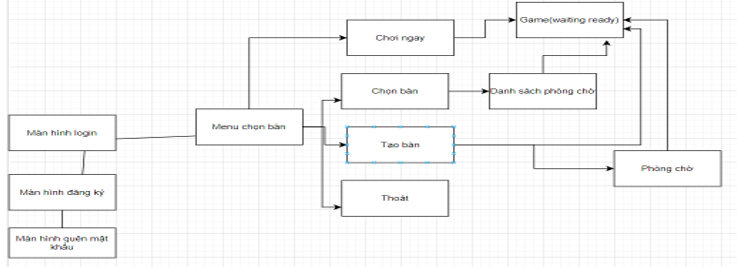

---

### 🔐 Login Screen  
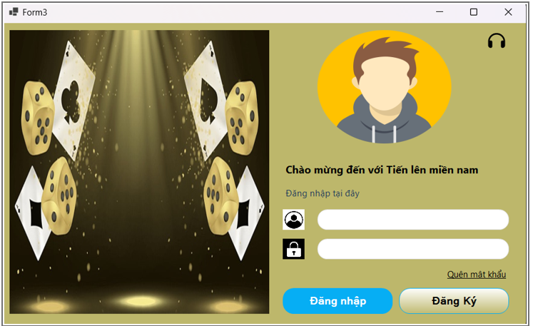

### 📝 Register Screen  

### 🔑 Forgot Password  
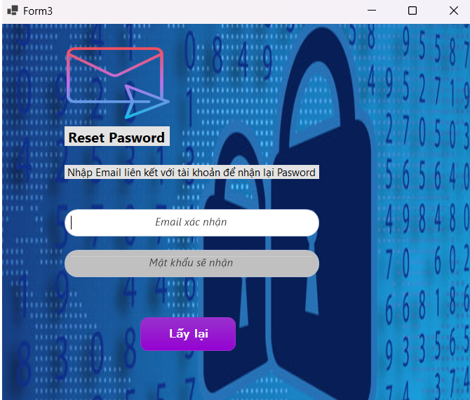

---

### 🏠 Main Menu  
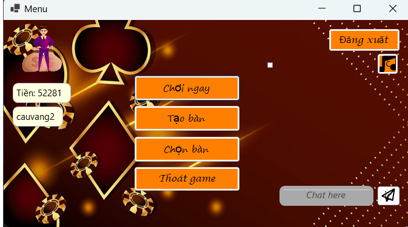

### 🛋️ Choose Room Interface  
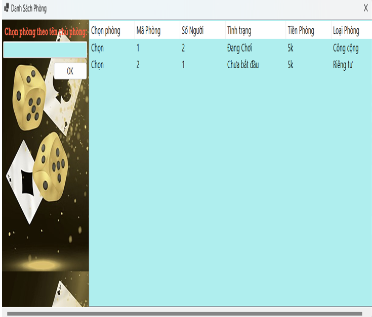

### 🎲 Join Random Room  
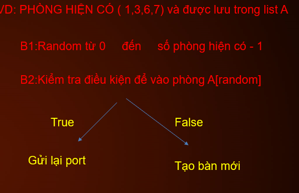

### 🛠️ Create New Table  
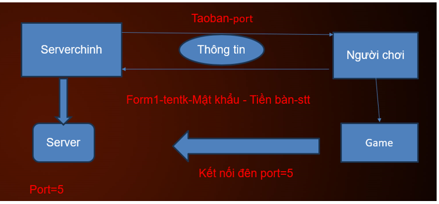

---

### 🃏 In-Game View (4 Players)  
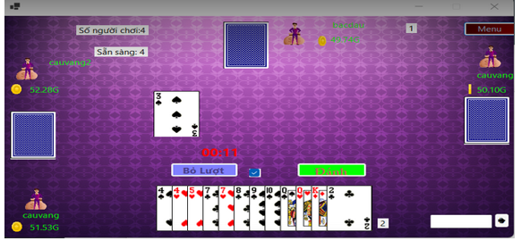

### 💰 Money Calculation Logic  
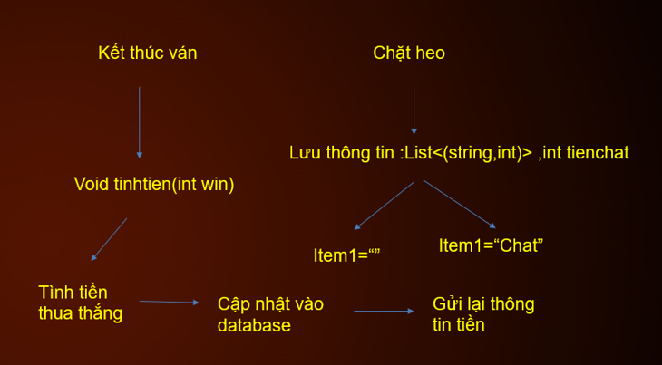

---

### 🌐 TCP Client–Server Network Architecture  
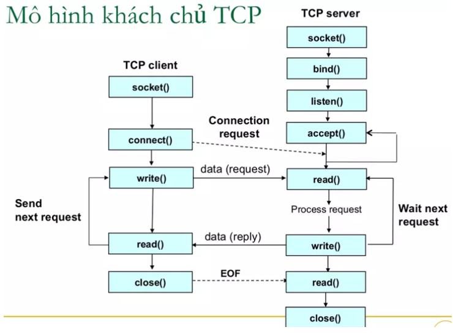

### 🧱 System Architecture Diagram  
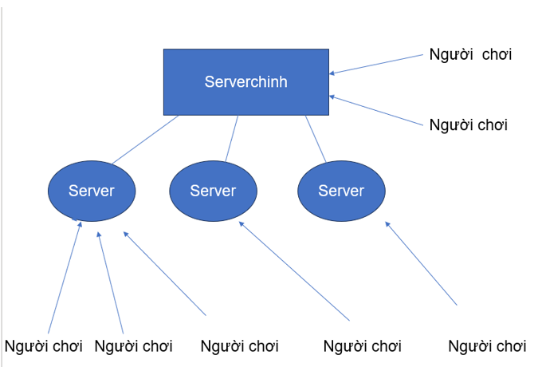

## 🚀 Features
- Real-time 4-player online card gameplay
- Multiple game rooms can exist and run concurrently
- Full implementation of Tiến Lên Miền Nam rules
- Room management: create room, search for rooms, join room
- Matchmaking system for selecting or creating tables
- Post-match reward system (money calculation and account update)
- Sound effects and WinForms GUI
- Player data persistence via SQL Server

## 👥 Team Members & Responsibilities

- 🎮 **Member 1**: Implemented complete game logic (card rules, turn checking, win condition)
- 🔊 **Member 2**: Developed SQL Server database, handled sound effects
- 🖧 **Me (Your Name)**:
  - Designed the entire **client–server architecture** using C# TCP Sockets
  - Implemented the **room management system**: create room, search room, join room
  - Developed **matchmaking logic**: choose room to join, display room list
  - Built **post-match reward system**, including money calculation and update to player accounts
  - Defined the communication protocol and packet structures for gameplay synchronization
